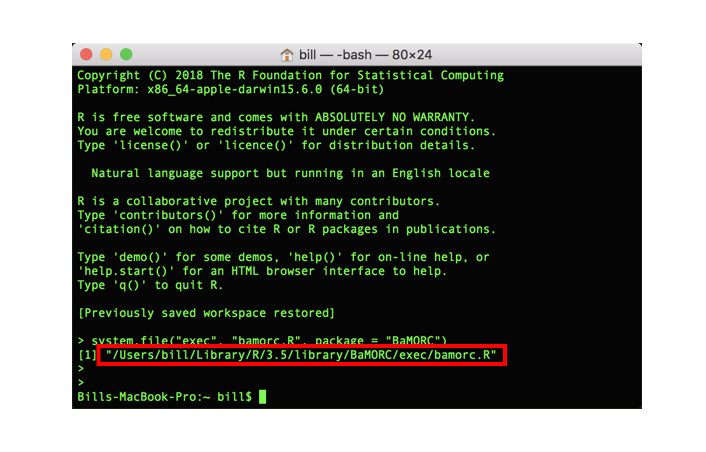

# BaMORC: Bayesian Model Optimized Reference Correction

## 
The BaMORC package was desinged to faciliate Protein NMR researchers with a easy tool revoluting the traditional protein NMR research pipeline by provide several new methods to allow detect and correct 13C referencing error at early data analysis step. 

Key features:

* Functions for data processing: 
    * `read_raw_file()`, processing user-provided data file.
    * `read_NMRSTAR_file()`, automatically process BMRB Star 2.0 and 3.0 files.
    * `read_DB_File()`, automatically fetch BMRB data and output appropriate format via BMRB entry ID number.

* Functions for calculating referencing correction value for assigned and unassigned carbon protein NMR spectra: `bamorc()` and `unassigned_bamorc()`.

* JPred secondary structure estimation wrapper: `jpred_fetcher()`.

* CLI functions for using shell.


`BaMORC` wouldn't be possible without the hard work of the authors of [RBMRB](https://cran.r-project.org/package=RBMRB) and [jpredapi](https://github.com/MoseleyBioinformaticsLab/jpredapir). Thanks!

## Installation

The latest stable version can be installed from CRAN:

``` r
install.packages('BaMORC')
```

The latest development version can be installed from github:

``` r
# install.packages("devtools")
devtools::install_github('xxxx/BaMORC')
```

### Installing unassigned BaMORC dependencies:

To use unassigned protein NMR reference correction method, SSC (Variance informed DBSCAN for protein NMR spin system clustering.) docker image is required and user need to install docker and SSC docker image

* Install Docker from [here](https://www.docker.com/products/docker-desktop).

* Install SSC docker image after docker is installed by running following code:
```
docker pull moseleybioinformaticslab/ssc .
```

## Package usage:
For detailed usage tutorial please refer to [Quick Start](inst/doc/quickstart.html)

Open terminal and type the following code:
```
> R -e 'system.file("exec", "bamorc.R", package = "BaMORC")'

```

You will see the R script location print out in the terminal as shown in following image.


And to test the R CLI script using the following pattern.
```
> <path to the R ClI scirpt>/bamorc.R -h
```

In the example code, it should be like:
```
/Users/bill/Library/R/3.5/library/BaMORC/exec/bamorc.R -h
```


* Install the SSC

```

```


## BaMORC Examples
```
library(BaMORC)

sequence <- paste(BaMORC::RefDB_data$carbonDat[[1]]$AA,collapse = "")
secondaryStructure <- paste(BaMORC::RefDB_data$carbonDat[[1]]$SS,collapse = "")
chemicaeclShifts_input <- BaMORC::RefDB_data$carbonDat[[1]][,c(4,5)]
from=-5
to=5

BaMORC(sequence, secondaryStructure, chemicaeclShifts_input, from=-5, to=5)
```
And the expected result is:

```
[1] 0.07073937 # Expected output

```


